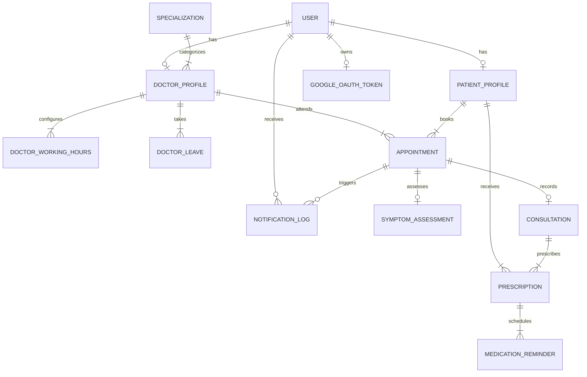

# CareFlow Healthcare Management Suite 🩺

CareFlow is a modern clinical scheduling and follow-up management platform engineered for healthcare providers, physicians, and patients. It eliminates double-booking through atomic slot holds, provides AI-driven pre-visit symptom triage, auto-translates doctor consultation notes into patient care plans, handles doctor leave collisions with automated rescheduling, and runs background medication reminders.

---

## 🌟 Key Features

- **Double-Booking Elimination**: DB-level compound unique constraints + 10-minute temporary atomic slot holds with auto-expiration.
- **AI Pre-Visit Symptom Triage**: Real-time analysis of chief complaints with urgency classification (`LOW`, `MEDIUM`, `HIGH`, `CRITICAL`) and physician inquiry prompts.
- **Clinical Consultation Workstation**: Real-time vital sign tracking, raw clinical note capture, dynamic multi-medication prescription builder, and automated AI plain-English translation.
- **Doctor Leave Conflict Resolution**: When doctor leave is approved, overlapping patient consultations are automatically marked as `RESCHEDULED` and priority reschedule notices are emailed.
- **Medication Tracker & Adherence**: Active prescription schedules with 1-click dose tracking and background reminders.
- **Google Calendar 2-Way Integration**: Instant 1-click sync and `.ics` iCalendar file downloads.
- **Background Cron Scheduler**: Automated 1-minute sweep for slot pruning, 24-hour appointment reminders, medication alerts, and email retry queues.

---

## 🚀 Quick Start Guide

### 1. Prerequisites
- **Node.js**: v18.17+ or v20+
- **npm** or **pnpm** / **yarn**

### 2. Installation
Clone the repository and install dependencies:
```bash
git clone <repository-url>
cd healthcare-manager
npm install
```

### 3. Environment Setup
Copy the `.env.example` file to `.env`:
```bash
cp .env.example .env
```

### 4. Database Setup & Seeding
Initialize the SQLite database schema and seed demo data (6 specialties, 5 doctors with working schedules, 3 patients with clinical histories):
```bash
npm run db:setup
```

### 5. Run the Development Server
```bash
npm run dev
```
Open **[http://localhost:3000](http://localhost:3000)** in your browser.

---

## 🔐 Demo Evaluation Personas

You can sign in with any of the following accounts (Password: `Online123`) or use the floating **"Switch Demo Persona"** button:

| Persona | Role | Email | Password | Primary Features |
| :--- | :--- | :--- | :--- | :--- |
| **Karthik** | `PATIENT` | `karthik@patient.careflow.health` | `Online123` | Book specialists, 10m slot hold, AI symptom triage |
| **Praveen** | `PATIENT` | `praveen@patient.careflow.health` | `Online123` | Active prescription adherence & Lisinopril reminders |
| **Dr. Satwik, MD** | `DOCTOR` | `satwik@careflow.health` | `Online123` | Cardiology queue, consult room & AI care plans |
| **Dr. Vinith, MD** | `DOCTOR` | `vinith@careflow.health` | `Online123` | Dermatology queue & symptom reviews |
| **Patnaik** | `ADMIN` | `admin@careflow.health` | `Online123` | Clinic KPI overview, leaves & notification audits |

---

## ⚙️ Environment Variables Reference (`.env.example`)

```env
# Database Connection (SQLite default for local dev; PostgreSQL supported for production)
DATABASE_URL="file:./dev.db"

# Auth Secrets
JWT_SECRET="super-secret-jwt-key-min-32-chars-long"
NEXTAUTH_SECRET="super-secret-nextauth-key-min-32-chars"
NEXTAUTH_URL="http://localhost:3000"

# LLM Providers (OpenAI GPT-4o-mini supported; auto heuristic fallback enabled if unset)
OPENAI_API_KEY="sk-..."
LLM_PROVIDER="openai"

# Email Configuration (Nodemailer / SMTP; simulated in console if not configured)
SMTP_HOST="smtp.sendgrid.net"
SMTP_PORT=587
SMTP_USER="apikey"
SMTP_PASS="your-smtp-password"
SMTP_FROM="CareFlow Clinic <appointments@careflow.health>"

# Google Calendar OAuth 2.0
GOOGLE_CLIENT_ID="your-google-client-id.apps.googleusercontent.com"
GOOGLE_CLIENT_SECRET="your-google-client-secret"
GOOGLE_REDIRECT_URI="http://localhost:3000/api/calendar/google/callback"

# App URL
NEXT_PUBLIC_APP_NAME="CareFlow Health"
NEXT_PUBLIC_APP_URL="http://localhost:3000"
CRON_SECRET="careflow-cron-secret-2026"
```

---

## 📅 Google Calendar OAuth Setup Steps

To enable live Google Calendar sync for appointments:

1. Go to the [Google Cloud Console](https://console.cloud.google.com/).
2. Create a new project named **CareFlow Health**.
3. Enable the **Google Calendar API** under **APIs & Services > Library**.
4. Configure the **OAuth Consent Screen**:
   - User Type: External
   - Scopes: `https://www.googleapis.com/auth/calendar.events`
   - Add Test Users (your testing Google email address).
5. Create OAuth 2.0 Credentials:
   - Application Type: **Web application**
   - Authorized redirect URIs: `http://localhost:3000/api/calendar/google/callback` (or your production URL `https://your-domain.com/api/calendar/google/callback`).
6. Copy the **Client ID** and **Client Secret** into your `.env` file (`GOOGLE_CLIENT_ID` and `GOOGLE_CLIENT_SECRET`).
7. Restart your development server. In the application, click **"Connect Google Cal"** in the top navigation bar.

---

## 🗄️ Database Schema & Architecture



---

## 🤖 LLM Prompts Architecture

The system employs tailored clinical prompts with structured JSON responses:

### 1. Pre-Visit AI Symptom Triage Prompt
```text
System: You are an expert Clinical Triage AI Assistant for CareFlow Healthcare.
Your role is to analyze patient reported symptoms and chief complaints prior to their consultation.

Task:
1. Determine Urgency Level: "LOW", "MEDIUM", "HIGH", or "CRITICAL".
2. Provide a 2-3 sentence clinical summary highlighting key symptom clusters.
3. Identify potential clinical condition categories to consider.
4. Formulate exactly 3 high-yield follow-up diagnostic questions for the doctor to ask.
5. Provide actionable pre-visit preparation advice for the patient (e.g. fasting, bringing medication list).

Output format: Return strictly valid JSON adhering to the schema:
{
  "urgencyLevel": "LOW" | "MEDIUM" | "HIGH" | "CRITICAL",
  "summary": string,
  "potentialConditions": string[],
  "questionsForDoctor": string[],
  "patientPreparationTips": string[]
}
```

### 2. Post-Visit Clinical Summary Translation Prompt
```text
System: You are a compassionate Patient Education & Medical Translation Specialist.
Your task is to translate doctor clinical notes and diagnosis into a clear, patient-friendly summary.

Task:
1. Explain the diagnosis and medical terms in simple, encouraging, 6th-grade reading level English.
2. Outline clear step-by-step follow-up and self-care instructions.
3. List 3 red-flag warning signs that require immediate medical attention.

Output format: Return strictly valid JSON adhering to the schema:
{
  "patientFriendlySummary": string,
  "followUpSteps": string[],
  "warningSignsToWatch": string[]
}
```

---

## 🔌 API Route Documentation

| Method | Endpoint | Description | Auth Required |
| :--- | :--- | :--- | :--- |
| `POST` | `/api/auth/register` | Register new Patient or Doctor with working hours | No |
| `POST` | `/api/auth/login` | Email + password authentication with JWT session cookie | No |
| `POST` | `/api/auth/switch-demo` | 1-click evaluation persona switcher | No |
| `GET` | `/api/auth/me` | Retrieve current authenticated user session | Yes |
| `GET` | `/api/specializations` | List all medical specialties | No |
| `GET` | `/api/doctors` | List doctors with specialty filter & fee details | No |
| `GET` | `/api/slots` | Generate available 30-min slots for a doctor & date | No |
| `POST` | `/api/slots/hold` | Place 10-minute temporary atomic lock on a slot | Yes (Patient) |
| `POST` | `/api/ai/symptoms` | Run pre-visit AI symptom triage assessment | Yes |
| `POST` | `/api/appointments` | Confirm slot booking with concurrency lock | Yes (Patient) |
| `GET` | `/api/appointments` | List appointments for patient or doctor | Yes |
| `GET` | `/api/appointments/:id` | Get full consultation details & triage data | Yes |
| `DELETE` | `/api/appointments/:id` | Cancel an appointment & dispatch notifications | Yes |
| `POST` | `/api/consultations` | Submit consultation notes, vitals & prescriptions | Yes (Doctor) |
| `GET` | `/api/leaves` | List active doctor leave schedules | Yes |
| `POST` | `/api/leaves` | Schedule doctor leave & auto-reschedule conflicting appointments | Yes (Doctor/Admin) |
| `GET` | `/api/cron/reminders` | Background scheduler sweep (prunes holds, sends reminders) | Public / Cron Key |
| `GET` | `/api/calendar/ics/:id` | Download universal `.ics` calendar invite file | Public |
| `GET` | `/api/calendar/google` | Check Google Calendar OAuth connection status | Yes |
| `POST` | `/api/calendar/google` | 1-Click connect or disconnect Google Calendar sync | Yes |
| `GET` | `/api/notifications` | Audit log stream of outbound email notifications | Yes (Admin) |
| `POST` | `/api/notifications/:id/retry` | Retry failed email notification dispatch | Yes (Admin) |

---

## 🚢 Deployment Guide (Vercel / Render / Railway)

### Deploying to Vercel (Recommended)
1. Push this repository to GitHub.
2. Import the project into [Vercel](https://vercel.com).
3. In **Project Settings > Environment Variables**, add:
   - `DATABASE_URL` (Use Supabase / Neon / PlanetScale PostgreSQL or Railway SQLite)
   - `JWT_SECRET`
   - `NEXTAUTH_SECRET`
   - `OPENAI_API_KEY`
4. Set Build Command: `npx prisma generate && npx prisma db push && next build`
5. Click **Deploy**.
