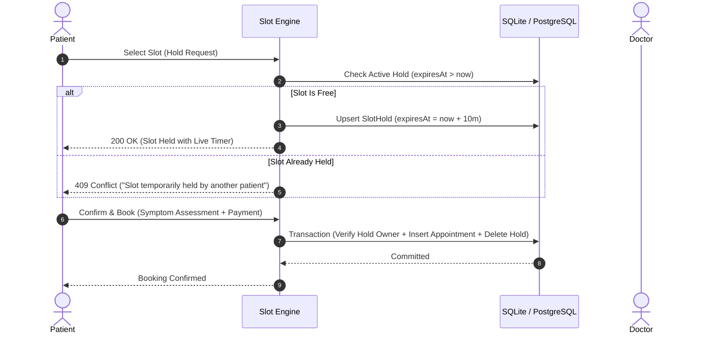

# CareFlow Healthcare Suite — System Design Document

## 1. Executive Summary & Core Architectural Goals
CareFlow is engineered for high-concurrency clinical appointment scheduling and intelligent post-visit care coordination. The platform addresses four critical distributed systems challenges in healthcare operations:
1. **Double-Booking Prevention**
2. **Temporary Slot Hold & Concurrency Control**
3. **Doctor Leave Collision Handling & Auto-Reschedule**
4. **Notification Fault Tolerance & Dead-Letter Recovery**

---

## 2. Double-Booking Prevention Mechanism
To guarantee that two patients cannot book the exact same physician time slot concurrently, CareFlow enforces a **dual-layer isolation strategy**:

1. **Database Schema Constraints**:
   - The `Appointment` table enforces a compound unique constraint: `@@unique([doctorId, startTime, status])` for active confirmed statuses, backed by indexed b-trees.
2. **Transactional Serializability**:
   - Appointment confirmation executes within an atomic Prisma `$transaction`. Before insertion, the engine queries overlapping confirmed appointments:
     ```typescript
     const conflict = await tx.appointment.findFirst({
       where: {
         doctorId,
         status: "CONFIRMED",
         AND: [
           { startTime: { lt: endDateTime } },
           { endTime: { gt: startDateTime } }
         ]
       }
     });
     if (conflict) throw new Error("Slot already booked.");
     ```
   - If an overlapping confirmed record exists or the insert violates the compound constraint, the transaction aborts with a rollback, preventing ghost reservations.

---

## 3. Slot Hold & Concurrency Control (10-Minute Lease Lock)
When a patient selects a 30-minute slot and proceeds to enter symptoms, the system acquires an optimistic lease lock:



- **Compound Constraint**: `SlotHold` table enforces `@@unique([doctorId, date, time])`.
- **Auto-Expiration**: Active holds expire strictly after 10 minutes (`expiresAt = Date.now() + 600000`). If a patient abandons checkout, the background scheduler sweeps and releases expired holds automatically.

---

## 4. Doctor Leave Conflict Handling & Cascading Rescheduling
When a doctor logs an unexpected or approved absence (e.g. sick leave, surgical conference), existing patient appointments are protected against silent cancellations:

1. **Leave Interception**: The `markDoctorOnLeave` routine receives the leave window (`startDate` to `endDate`).
2. **Collision Query**:
   ```typescript
   const conflicting = await prisma.appointment.findMany({
     where: {
       doctorId,
       status: "CONFIRMED",
       startTime: { gte: leaveStart, lte: leaveEnd }
     },
     include: { patient: { include: { user: true } } }
   });
   ```
3. **Atomic Reschedule Pipeline**:
   - In a single atomic batch, all conflicting appointments are updated to `status: "RESCHEDULED"`.
   - The system records the collision event in the admin audit log.
   - Dispatches a priority email notification to each affected patient containing their booking reference and an expedited 1-click rescheduling link.

---

## 5. Notification Failure & Dead-Letter Handling
Clinical notifications (booking confirmations, 24-hour visit reminders, and prescription adherence alerts) must not be lost due to upstream SMTP timeouts or network partitions:

1. **Persistent Audit Logging**: Every outbound message is logged in the `NotificationLog` table with initial `status: "SENT"` or `"FAILED"`.
2. **Failure Capture & Exponential Retry**:
   - If an SMTP dispatch fails, the error reason is stored in `NotificationLog.error` and `retryCount` is incremented.
   - The background cron worker (`/api/cron/reminders`) sweeps failed notifications where `retryCount < 3` and `status = "FAILED"`, retrying delivery with backoff.
3. **Admin Intervention Console**: System administrators can view the real-time notification stream at `/admin/notifications` and trigger 1-click manual retries on any persistent failures.

---

## 6. Architectural Summary Matrix

| Failure Mode | Prevention Mechanism | Recovery Protocol |
| :--- | :--- | :--- |
| **Simultaneous Checkout** | 10-Minute Leased `SlotHold` | Real-time countdown timer; auto-pruning after 600s |
| **Race Condition on Final Submit** | Prisma `$transaction` + DB compound index | Immediate transaction rollback with descriptive 409 error |
| **Physician Leave Overlap** | Interval intersection search across confirmed appointments | Cascading batch status to `RESCHEDULED` + automated patient alert |
| **Email SMTP Network Drop** | Database-persisted `NotificationLog` audit stream | Background cron retries up to 3x + Admin 1-click retry UI |
